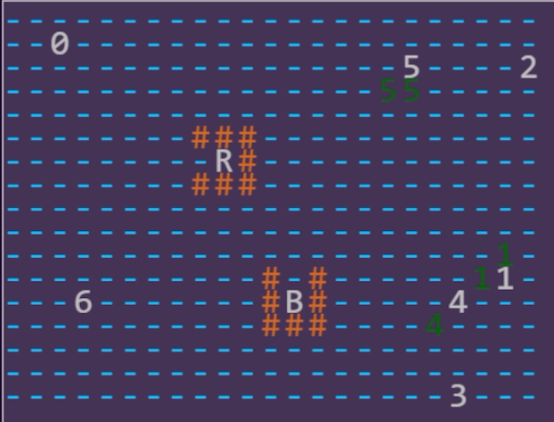

= Hircine Anise Okkoz (aka haokkoz)

== Purpose

Hircine Anise Okkoz (will eventually) plays jdno's https://auto-traffic-control.com/docs[Auto Traffic Control] game.
That is to say, it is a grpc client that connects to an ATC server and receives events (and eventually issues its own).

== License

Hircine Anise Okkoz is released under the terms of the Apache license v2.0 (or the most recently published).

== Run

. Start atc
. Start hao
. Open webpage

Starting atc involves running the auto-traffic-control executable.
Start haokkoz by invoking the jar.
The source project includes configuration such that `gradle run` will start it.
Otherwise, download all the dependencies and the haokkoz jar and invoke `java -jar haokkoz.jar` with whatever version extension is available.
Then, open the index.html page in a compatible web browser (it must support canvas and websockets).
This will start the simulation.

== Name

The full name of this project is Hircine Anise Okkoz, though it is contracted to Haokkoz in a number of places.
It is a three word phrase with no particular meaning.
Hircine means goat like.
Anise is a flowering plant used as a spice.
Okkoz is a latinization of numeral 4 in the Proto-Berber language.

== Status

version 0.0-alpha-5.2

== Design

Haokkoz mostly communicates internally via concurrent queues. To see the relationships, render the graphviz queues.dot file in docs/modules.

